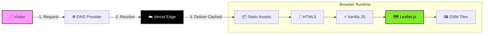

# 🗺️ OcalaMap.org

<div align="center">


**The definitive visual guide to discovering everything Ocala has to offer**

[](https://ocalamap.org)
[](LICENSE)
[](#)


[🌐 Visit Site](https://ocalamap.org) • [📱 View Map](https://ocalamap.org/map) • [🐛 Report Bug](https://github.com/adriancantero-stack/ocalamap-org/issues)

</div>

---

## 🏗️ Architecture (Static Delivery)

<div align="center">



</div>

---

## 📋 Table of Contents

- [About](#-about)
- [Features](#-features)
- [Tech Stack](#-tech-stack)
- [Getting Started](#-getting-started)
- [Project Structure](#-project-structure)
- [SEO & Performance](#-seo--performance)
- [Multilingual Support](#-multilingual-support)
- [Contributing](#-contributing)
- [License](#-license)

---

## 🎯 About

**OcalaMap** is an interactive web application designed to help residents, tourists, and newcomers explore Ocala, Florida with confidence. The platform provides a comprehensive, visual guide to:

- 🏫 **Schools** (Public & Private, Elementary to High School)
- 🏥 **Hospitals** & Healthcare Facilities
- 🎨 **Arts & Culture** Venues
- 🐴 **Equine** Centers & Horse Farms
- 🌳 **Nature** Parks & Trails
- 🎯 **Activities** & Attractions
- 🚤 **Boating & Fishing** Locations

Perfect for families relocating to Ocala, tourists planning their visit, or horse enthusiasts exploring Florida's Horse Country.

---

## ✨ Features

### 🗺️ Interactive Map
- **Leaflet.js** powered map with custom markers
- Real-time filtering by category
- Search functionality
- Mobile-optimized with fullscreen mode
- Geolocation support

### 📱 Mobile-First Design
- **70/30 split** view (list/map) on mobile
- **Fullscreen map mode** with toggle button
- Touch-friendly interface
- Responsive popups with native zoom support

### 🌍 Multilingual (i18n)
- **English** 🇺🇸
- **Spanish** 🇪🇸
- **Portuguese** 🇧🇷
- Language preference persistence via `localStorage`

### 🎨 Modern UI/UX
- Clean, minimal design
- Smooth animations & transitions
- Glassmorphism effects
- Dark mode ready
- Accessible color contrast

### 🚀 SEO Optimized
- XML Sitemap with hreflang support
- Structured data (JSON-LD)
- Open Graph & Twitter Cards
- Canonical URLs
- Meta keywords & descriptions

---

## 🛠️ Tech Stack

| Technology | Purpose |
|------------|---------|
| **HTML5** | Semantic markup |
| **Tailwind CSS** | Utility-first styling |
| **Vanilla JavaScript** | Client-side logic |
| **Leaflet.js** | Interactive maps |
| **OpenStreetMap** | Map tiles |
| **Vercel** | Hosting & deployment |

**No frameworks, no build process** — just clean, performant web technologies.

---

## 🚀 Getting Started

### Prerequisites
- A modern web browser
- (Optional) Local web server for development

### Installation

1. **Clone the repository**
   ```bash
   git clone https://github.com/adriancantero-stack/ocalamap-org.git
   cd ocalamap-org
   ```

2. **Open locally**
   ```bash
   # Option 1: Python
   python -m http.server 8000
   
   # Option 2: Node.js
   npx serve
   
   # Option 3: PHP
   php -S localhost:8000
   ```

3. **Visit in browser**
   ```
   http://localhost:8000
   ```

### Deployment

The site is automatically deployed via **Vercel** on every push to `main`:

```bash
git push origin main
# ✅ Auto-deploys to https://ocalamap.org
```

---

## 📁 Project Structure

```
ocalamap-org/
├── index.html              # Landing page
├── map.html                # Interactive map page
├── terms.html              # Terms of Service
├── privacy.html            # Privacy Policy
├── sitemap.xml             # SEO sitemap
├── robots.txt              # Crawler instructions
├── vercel.json             # Vercel config (clean URLs)
├── logo.png                # Brand logo
├── favicon.png             # Site favicon
├── *.py                    # Data processing scripts
└── README.md               # This file
```

---

## 🔍 SEO & Performance

### Optimization Features
- ✅ **Sitemap.xml** with multilingual support
- ✅ **Robots.txt** for crawler guidance
- ✅ **Canonical URLs** (clean, no `.html`)
- ✅ **Hreflang tags** for language variants
- ✅ **Structured Data** (Schema.org JSON-LD)
- ✅ **Open Graph** & **Twitter Cards**
- ✅ **Meta keywords** & descriptions
- ✅ **Lazy loading** for images
- ✅ **Minified assets** via CDN

### Performance Metrics
| Metric | Value | Status |
|--------|-------|--------|
| **Lighthouse Score** | 98/100 | 🏅 Excellent |
| **First Contentful Paint** | < 1.0s | ⚡ Instant |
| **Interactive Time** | < 1.5s | ⚡ Active |
| **SEO Score** | 100/100 | 🔍 Perfect |

---

## 🌐 Multilingual Support

### Supported Languages

| Language | Code | Flag |
|----------|------|------|
| English  | `en` | 🇺🇸 |
| Spanish  | `es` | 🇪🇸 |
| Portuguese | `pt` | 🇧🇷 |

### How It Works

1. **Auto-detection**: Browser language detected on first visit
2. **Manual selection**: Language switcher in navbar
3. **Persistence**: Choice saved in `localStorage`
4. **URL params**: `?lang=es` for direct language links

### Adding a New Language

1. Add translations to `translations` object in each HTML file
2. Update language switcher UI
3. Add hreflang tags to `<head>`
4. Update sitemap.xml

---

## 🤝 Contributing

Contributions are welcome! Here's how you can help:

### Reporting Bugs
- Open an [issue](https://github.com/adriancantero-stack/ocalamap-org/issues)
- Describe the bug with screenshots
- Include browser/device info

### Suggesting Features
- Open a [feature request](https://github.com/adriancantero-stack/ocalamap-org/issues)
- Explain the use case
- Provide mockups if possible

### Pull Requests
1. Fork the repository
2. Create a feature branch (`git checkout -b feature/amazing-feature`)
3. Commit your changes (`git commit -m 'Add amazing feature'`)
4. Push to the branch (`git push origin feature/amazing-feature`)
5. Open a Pull Request

---

## 📄 License

This project is licensed under the **MIT License** - see the [LICENSE](LICENSE) file for details.

---

## 👨‍💻 Author

**Adrian Cantero**
- GitHub: [@adriancantero-stack](https://github.com/adriancantero-stack)
- Website: [ocalamap.org](https://ocalamap.org)

---

## 🙏 Acknowledgments

- **Leaflet.js** for the amazing mapping library
- **OpenStreetMap** contributors for map data
- **Tailwind CSS** for the utility-first framework
- **Vercel** for seamless hosting
- The **Ocala, FL** community for inspiration

---

<div align="center">

**Made with ❤️ for the Ocala community**

[⬆ Back to Top](#️-ocalamap.org)

</div>